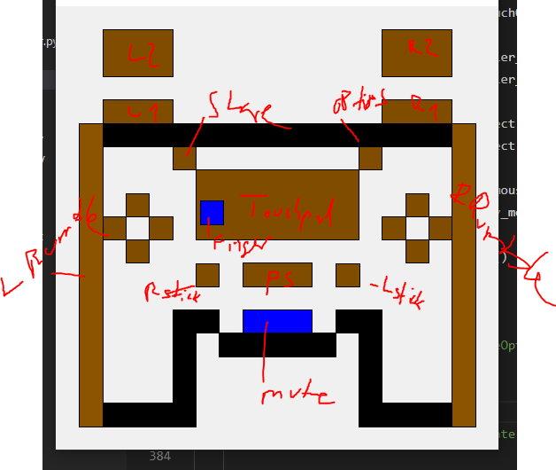

```bash 
pip install tkinter
```
```bash 
pip install autopy
```
```bash 
python ./examples/controller_demo.py
```


# pydualsense
control your dualsense through python. using the hid library this package implements the report features for controlling your new PS5 controller. 

# install

Download [hidapi](https://github.com/libusb/hidapi/releases) and place the x64 .dll file into your Workspace. After that install the package from [pypi](https://pypi.org/project/pydualsense/). 

```bash
pip install pydualsense
```
# usage

```python

from pydualsense import pydualsense, TriggerModes

ds = pydualsense() # open controller
ds.init() # initialize controller
ds.light.setColorI(255,0,0) # set touchpad color to red
ds.triggerL.setMode(TriggerModes.Rigid)
ds.triggerL.setForce(1, 255)
ds.close() # closing the controller
```

See [examples](https://github.com/flok/pydualsense/tree/master/examples) folder for some more ideas

# Help wanted

Help wanted from people that want to use this and have feature requests. Just open a issue with the correct label.

# dependecies

- hid >= 1.0.4

# Credits


Most stuff for this implementation were provided by and used from:


- [https://www.reddit.com/r/gamedev/comments/jumvi5/dualsense_haptics_leds_and_more_hid_output_report/](https://www.reddit.com/r/gamedev/comments/jumvi5/dualsense_haptics_leds_and_more_hid_output_report/)
- [https://github.com/Ryochan7/DS4Windows](https://github.com/Ryochan7/DS4Windows)

# Coming soon

- add bluetooth support
- add multiple controllers
- reading the states of the controller to enable a fully compatibility with python - partially done
- add documentation using sphinx
